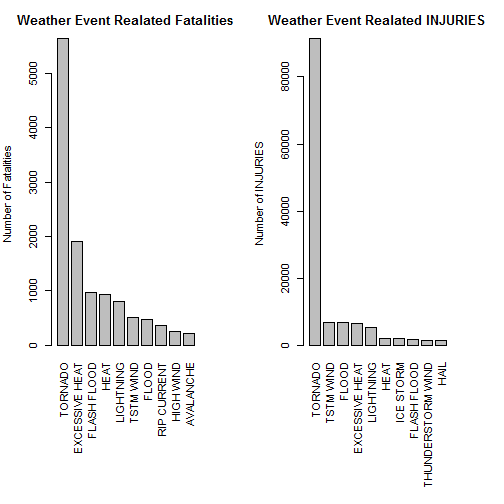
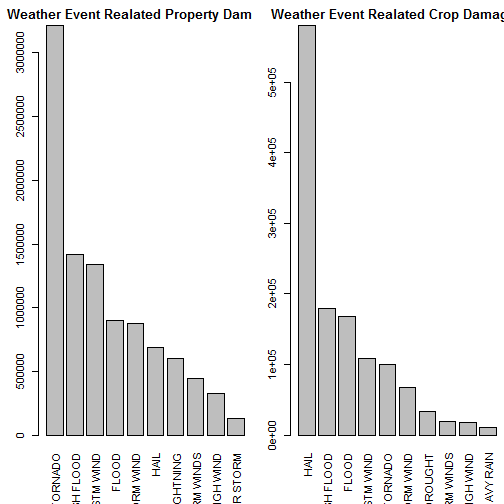

----------------------
title: "PeerAssesment2"
output: html_document
----------------------


```r
library(R.utils)
```

```
## Warning: package 'R.utils' was built under R version 3.1.3
```

```
## Loading required package: R.oo
```

```
## Warning: package 'R.oo' was built under R version 3.1.3
```

```
## Loading required package: R.methodsS3
```

```
## Warning: package 'R.methodsS3' was built under R version 3.1.3
```

```
## R.methodsS3 v1.7.0 (2015-02-19) successfully loaded. See ?R.methodsS3 for help.
## R.oo v1.19.0 (2015-02-27) successfully loaded. See ?R.oo for help.
## 
## Attaching package: 'R.oo'
## 
## The following objects are masked from 'package:methods':
## 
##     getClasses, getMethods
## 
## The following objects are masked from 'package:base':
## 
##     attach, detach, gc, load, save
## 
## R.utils v2.0.0 (2015-02-28) successfully loaded. See ?R.utils for help.
## 
## Attaching package: 'R.utils'
## 
## The following object is masked from 'package:utils':
## 
##     timestamp
## 
## The following objects are masked from 'package:base':
## 
##     cat, commandArgs, getOption, inherits, isOpen, parse, warnings
```

```r
library(ggplot2)
```


```r
if (! file.exists("C:/Users/538321/Documents/DataManagement/ReproducibleResearch/assignment2/repdata_data_StormData.csv.bz2")){
  download.file("https://d396qusza40orc.cloudfront.net/repdata%2Fdata%2FStormData.csv.bz2")
  
}

if (!file.exists("repdata_data_StormData.csv")){
  bunzip2("C:/Users/538321/Documents/DataManagement/ReproducibleResearch/assignment2/repdata_data_StormData.csv.bz2", overwrite = "FALSE", remove = FALSE)
}
stormData <- read.csv("C:/Users/538321/Documents/DataManagement/ReproducibleResearch/assignment2/repdata_data_StormData.csv")
# storm <- read.csv(bzfile("C:/Users/538321/Documents/DataManagement/ReproducibleResearch/assignment2/repdata_data_StormData.csv.bz2"))                            
```
-----------------------------------------------------------------------
Get a subset of data of all types of events, fatalities , Injuries and
damage generated to property and crops
Get unique set of data from the subset to identify each damage type 
to a value.
For Example if the Property Damage XP == K assign a value 1000
If the Property Damage XP == M assign a value of 1 Million( This is
what the directions in the assignment say)
These variables are associated with PROPDMGEXP and CROPDMGEXP which are used
as exponents to interpret the numeric values for the damage. There are not much
information in the data code book about these variables.

The only symbols with a clear meaning are:

* H or h: for hundredth of dollars
* K or k: for thousands of dollars
* M or m: for million of dollars
* B or b: for billion of dollars
If it is ? or == then I gave a value 0
For "" I gave value 1

We sum the damage values grouped by the symbols.
We see that the symbols without a clear meaning are associated with minimal
values. So we use only the H, K, M, B symbols to interpret the damage amounts
and we clear the amounts for the other symbols.

-----------------------------------------------------------------------


```r
colOfInterest <- c("EVTYPE","FATALITIES", "INJURIES", "PROPDMG","PROPDMGEXP",
"CROPDMG", "CROPDMGEXP" )

eventAndFatality <- stormData[colOfInterest]

head(eventAndFatality)
```

```
##    EVTYPE FATALITIES INJURIES PROPDMG PROPDMGEXP CROPDMG CROPDMGEXP
## 1 TORNADO          0       15    25.0          K       0           
## 2 TORNADO          0        0     2.5          K       0           
## 3 TORNADO          0        2    25.0          K       0           
## 4 TORNADO          0        2     2.5          K       0           
## 5 TORNADO          0        2     2.5          K       0           
## 6 TORNADO          0        6     2.5          K       0
```

```r
unique(eventAndFatality$PROPDMGEXP)
```

```
##  [1] K M   B m + 0 5 6 ? 4 2 3 h 7 H - 1 8
## Levels:  - ? + 0 1 2 3 4 5 6 7 8 B h H K m M
```

```r
eventAndFatality$PROPEXP[eventAndFatality$PROPDMGEXP == "K"] <- 1000

eventAndFatality$PROPEXP[eventAndFatality$PROPDMGEXP == "M"] <- 1e+06


eventAndFatality$PROPEXP[eventAndFatality$PROPDMGEXP == ""] <- 1

eventAndFatality$PROPEXP[eventAndFatality$PROPDMGEXP == "B"] <- 1e+09

eventAndFatality$PROPEXP[eventAndFatality$PROPDMGEXP == "m"] <- 1
eventAndFatality$PROPEXP[eventAndFatality$PROPDMGEXP == "+"] <- 0
eventAndFatality$PROPEXP[eventAndFatality$PROPDMGEXP == "O"] <- 1
eventAndFatality$PROPEXP[eventAndFatality$PROPDMGEXP == "5"] <- 1e+05
eventAndFatality$PROPEXP[eventAndFatality$PROPDMGEXP == "6"] <- 1e+6
eventAndFatality$PROPEXP[eventAndFatality$PROPDMGEXP == "4"] <- 10000
eventAndFatality$PROPEXP[eventAndFatality$PROPDMGEXP == "2"] <- 100
eventAndFatality$PROPEXP[eventAndFatality$PROPDMGEXP == "3"] <- 1000
eventAndFatality$PROPEXP[eventAndFatality$PROPDMGEXP == "h"] <- 100
eventAndFatality$PROPEXP[eventAndFatality$PROPDMGEXP == "7"] <- 1e+7
eventAndFatality$PROPEXP[eventAndFatality$PROPDMGEXP == "H"] <- 100
eventAndFatality$PROPEXP[eventAndFatality$PROPDMGEXP == "-"] <- 0
eventAndFatality$PROPEXP[eventAndFatality$PROPDMGEXP == "1"] <- 100
eventAndFatality$PROPEXP[eventAndFatality$PROPDMGEXP == "8"] <- 1e+08
eventAndFatality$PROPEXP[eventAndFatality$PROPDMGEXP == "?"] <- 0

eventAndFatality$PROPDMGVAL <- eventAndFatality$PROPEXP*eventAndFatality$PROPDMG
```

-------------------------------------------------
Assess Crop Damage in similar lines as above 
----------------------------------------------------


```r
unique(eventAndFatality$CROPDMGEXP)
```

```
## [1]   M K m B ? 0 k 2
## Levels:  ? 0 2 B k K m M
```

```r
eventAndFatality$CROPEXP[eventAndFatality$CROPDMGEXP == "M"] <- 1e+06
eventAndFatality$CROPEXP[eventAndFatality$CROPDMGEXP == "K"] <- 1000
eventAndFatality$CROPEXP[eventAndFatality$CROPDMGEXP == "m"] <- 1
eventAndFatality$CROPEXP[eventAndFatality$CROPDMGEXP == "B"] <- 1e+09
eventAndFatality$CROPEXP[eventAndFatality$CROPDMGEXP == "?"] <- 0
eventAndFatality$CROPEXP[eventAndFatality$CROPDMGEXP == "2"] <- 100
eventAndFatality$CROPEXP[eventAndFatality$CROPDMGEXP == "O"] <- 1
eventAndFatality$CROPEXP[eventAndFatality$CROPDMGEXP == ""] <- 1
eventAndFatality$CROPEXP[eventAndFatality$CROPDMGEXP == "k"] <- 1000

eventAndFatality$CROPDMGVAL <- eventAndFatality$CROPEXP*eventAndFatality$CROPDMG
```

--------------------------------------------------------------------------
Aggregate Data By Event. Get the Total fatalities and Injuries by group.


Since the data is large I decided to get the top ten Fatalities and Injuries
that have impact on property and crop damage. To get Top 10 Fatalities
you need to order descending.
----------------------------------------------------------------------------
-------------------------------------------------------------------------
Generate Bar Plot that shows side by side Fatalaities to Event Type 
and Injuries to Event Type
-------------------------------------------------------------------------


```r
fatalities <- aggregate(FATALITIES~EVTYPE, data=eventAndFatality, FUN = sum )
injury <- aggregate(INJURIES~EVTYPE, data=eventAndFatality, FUN = sum)
propdmg <- aggregate(PROPDMG ~EVTYPE, data=eventAndFatality, FUN = sum)
cropdmg <- aggregate(CROPDMG ~EVTYPE, data=eventAndFatality, FUN = sum)

fatalitiesByOrder <- fatalities[order(-fatalities$FATALITIES),]
##Injuries in Ascending Order
InjuriesByOrder <- injury[order(-injury$INJURIES),]
topTenInjuries <- InjuriesByOrder[1:10,]
topTenFatalities <- fatalitiesByOrder[1:10,]

par(mfrow = c(1,2), mar = c(12,4,3,4), mgp= c(3,1,0), cex = 0.9)
barplot(topTenFatalities$FATALITIES, names.arg = topTenFatalities$EVTYPE, las = 3,  main = "Weather Event Realated Fatalities", ylab = "Number of Fatalities")

barplot(topTenInjuries$INJURIES, names.arg = topTenInjuries$EVTYPE, las = 3,  main = "Weather Event Realated INJURIES", ylab = "Number of INJURIES")
```

 
---------------------------------------------------------------------------
Across the United States, Which types of events have greates property damage
----------------------------------------------------------------------------

```r
propdmg <- aggregate(PROPDMG ~EVTYPE, data=eventAndFatality, FUN = sum)
cropdmg <- aggregate(CROPDMG ~EVTYPE, data=eventAndFatality, FUN = sum)

propertyDamageByOrder <- propdmg[order(-propdmg$PROPDMG),]
topTenPropertyDamages <- propertyDamageByOrder[1:10,]

cropDamageByOrder <- cropdmg[order(-cropdmg$CROPDMG),]
topTenCropDamages <- cropDamageByOrder[1:10,]

par(mfrow = c(1,2), mar = c(5,3,2,0), mgp= c(4,1,0), cex = 0.9)
barplot(topTenPropertyDamages$PROPDMG, names.arg = topTenPropertyDamages$EVTYPE, las = 3,  main = "Weather Event Realated Property Damages", ylab = "Number of Property Damages")

barplot(topTenCropDamages$CROPDMG, names.arg = topTenCropDamages$EVTYPE, las = 3,  main = "Weather Event Realated Crop Damages", ylab = "Number of CROP DAMAGES")
```

 


